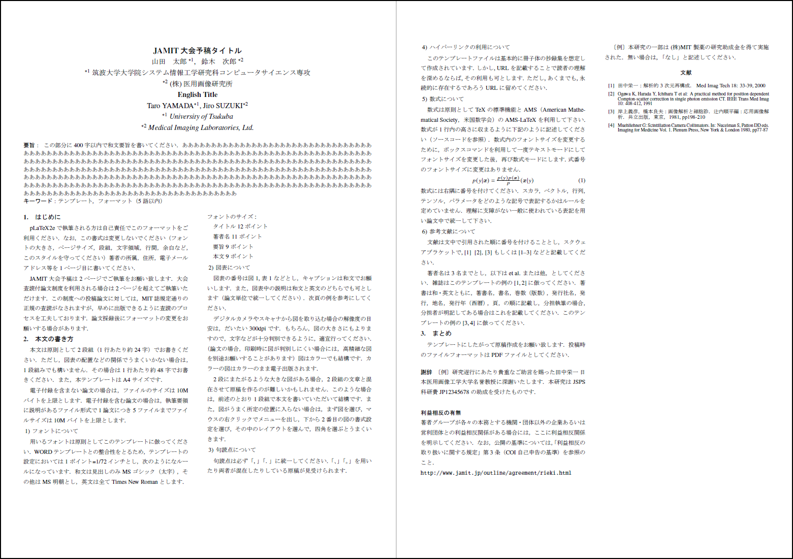

# JAMIT大会風 原稿テンプレート
pLaTeX2eを用いて日本語で原稿執筆を行うためのテンプレートファイル. 日本医用画像工学会大会の予稿原稿集のフォーマット（2024年）に準拠した仕様. ただし，WORDテンプレート（大会公式）では数式のフォントとしてCambria mathを利用していますが，このpLaTeX2eテンプレートではTimes New Romanを用います．


## How to use 
使用方法については同梱のソースファイル `template.tex` と生成された `template.pdf` を参照してください. 
配布ファイルの文字コードはeuc-jpです. いずれはUTF-8に対応する予定. 




## Compile
`xamit.cls` や画像ファイルがソースファイルと同じディレクトリ下にある状態で以下のコマンドを実行してください. 
```  
$ platex --kanji=euc-jp template.tex
$ dvipdfmx template.dvi
```
文献情報や図表などに関する相互参照を更新する際には、2回 platex でコンパイルしてからpdfを生成（dvipdfmxを実行）するようにしてください. 

## Change log

- 2024 5/13
    - 公開開始

